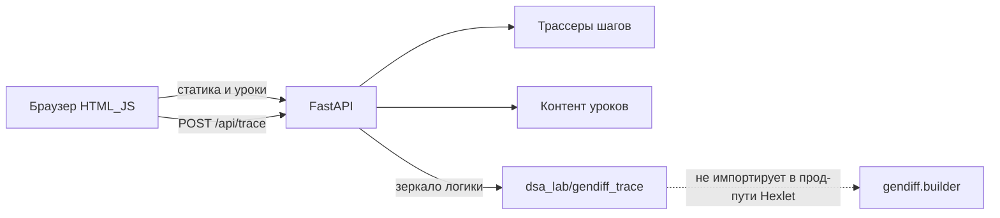

# Учебный Gendiff плюс DSA

## Что от Gendiff

CLI и пакет [`gendiff/`](gendiff/) не трогаем: Hexlet-проверки в [`Makefile`](Makefile) (`make check`) и [`.github/workflows/pyci.yml`](.github/workflows/pyci.yml) должны продолжать линтить и тестировать только `gendiff`. Трассировку алгоритмов дублируем в отдельном пакете, а не внедряем в [`gendiff/builder.py`](gendiff/builder.py).

Якоря из текущего кода = примеры:

- объединение ключей и `sorted(...)` в [`build_diff`](gendiff/builder.py) — хеш-таблица + сортировка;
- рекурсия по вложенным словарям (`type: nested`);
- список узлов diff — массив/список;
- обход дерева в [`format_stylish`](gendiff/formatters/stylish.py) (`walk`) — DFS по дереву.

## Архитектура



Новые части:

- [`dsa_lab/`](dsa_lab/) — FastAPI-приложение, контент уроков, трассеры алгоритмов;
- [`web/templates/`](web/templates/) и [`web/static/`](web/static/) — русский UI без React;
- цель Makefile: `make dsa-lab` → `poetry run uvicorn dsa_lab.app:app --reload`.

Зависимости в [`pyproject.toml`](pyproject.toml): `fastapi`, `uvicorn`, `jinja2`. Основной пакет `gendiff` и скрипт `gendiff` не меняются.

## Как устроен урок

Каждый раздел — одна страница по шаблону:

1. Жизненная аналогия (карточка).
2. Зачем это middle-разработчику.
3. Блок «В gendiff» — если тема реально встречается в коде; иначе честно «здесь gendiff не использует это, но вот зачем оно в бою».
4. Короткая теория.
5. Интерактив: Play / Pause / Шаг назад-вперёд по JSON-трассе с бэкенда.
6. Памятка Big O.
7. Мини-проверка на 2–3 вопроса.

Общий контракт трассы:

```json
{
  "meta": { "algorithm": "quicksort", "complexity": "O(n log n)" },
  "steps": [
    { "message": "...", "highlight": [], "snapshot": {}, "focus": {} }
  ]
}
```

Фронт: [`web/static/js/player.js`](web/static/js/player.js) крутит шаги, [`web/static/js/viz.js`](web/static/js/viz.js) рисует SVG (массивы, списки, деревья, графы, таблицы DP). Стили — один файл [`web/static/css/app.css`](web/static/css/app.css).

## Разделы (все семь)

**1. Введение и Big O**  
Аналогия: очередь в магазине vs экспресс-касса. Слайдер `n` и графики O(1)/O(n)/O(n log n)/O(n²). Связка: поиск ключа в dict — O(1), `sorted(keys)` на уровне — O(k log k), рекурсия по вложенности — глубина дерева.

**2. Базовые структуры**  
Полка с номерами (массив), вагоны поезда (список), стопка тарелок (стек), очередь в кассу, шкафчик с номером (хеш-таблица). Площадки: push/pop, enqueue/dequeue, insert/lookup. Связка: JSON-объект как dict, `diff = []` как список узлов.

**3. Поиск и сортировки**  
Линейный vs бинарный (словарь), пузырёк/вставки/слияние/быстрая — с анимацией сравнений и обменов. Связка: зачем `sorted` в `build_diff` (стабильный человекочитаемый вывод).

**4. Рекурсия**  
Матрёшка / папки в папках. Визуализация стека вызовов. Главный демо: пошаговый `build_diff` на вложенных JSON из [`gendiff/files/nested1.json`](gendiff/files/nested1.json) и `nested2.json`.

**5. Деревья**  
Оргструктура. Интерактив: дерево diff из реального сравнения + BST (вставка/поиск) + упрощённые повороты AVL. Связка: `walk` в stylish — DFS.

**6. Графы**  
Карта метро. Список смежности vs матрица, BFS/DFS, Дейкстра, Флойд на маленьком графе. Честно: gendiff работает с деревом, не с общим графом; графы — следующий шаг после деревьев.

**7. DP и жадные**  
Маршруты без повторного пересчёта vs «брать ближайшее». Интерактив: сдача монетами (жадный vs DP). Честно: gendiff это не использует.

## API

- `GET /` — каталог разделов.
- `GET /lessons/{slug}` — страница урока.
- `POST /api/trace/{algorithm}` — прогон с пользовательским вводом, ответ — шаги.
- `POST /api/gendiff/trace` — два JSON-объекта → шаги построения diff-дерева (зеркало [`build_diff`](gendiff/builder.py)).

Алгоритмы трассеров: `linear_search`, `binary_search`, `bubble_sort`, `insertion_sort`, `merge_sort`, `quick_sort`, `stack`, `queue`, `hash_table`, `linked_list`, `bst`, `avl_insert`, `bfs`, `dfs`, `dijkstra`, `floyd`, `coin_change_greedy`, `coin_change_dp`, `gendiff_build`.

## Тесты и запуск

- Юнит-тесты трассеров в `tests/test_dsa_lab.py` (первый/последний шаг, инварианты: отсортированный массив, найденный индекс, корректное diff-дерево).
- `make lint` по-прежнему только `gendiff`, чтобы не сломать Hexlet; отдельно `make dsa-lint` при желании.
- В [`README.md`](README.md) — короткий блок: зачем кабинет, `make dsa-lab`, открыть `http://127.0.0.1:8000`.
